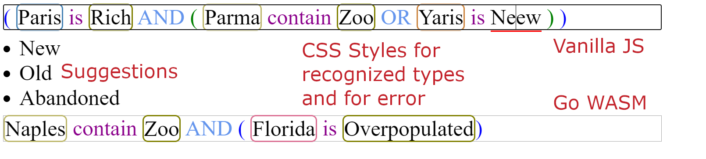

# expressionParser
### About:
A simple expression parser in vanilla javascript, also partial implented in Go WASM (second input).
### To try it out:
- run "npm install"
- run "node main.js"

### Notice: Works with google chrome